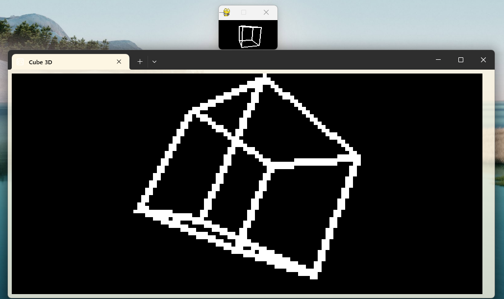

# pygtui
Membuat modul PyGame versi Terminal (Text User Interface)

> Note: modul ini masih dalam proses pengembangan, jadi masih banyak fitur yang belum ada atau banyak bug.

Hasilnya dari menjalan cube.py:  

